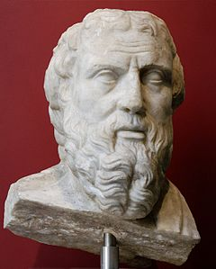

&nbsp;

<a title="Herodotus" href="https://en.wikipedia.org/wiki/Herodotus">Herodotus</a>&nbsp;(c. 484 BC &ndash; c. 425 BC), often considered the "father of history"

&nbsp;

&nbsp;

<strong>Those who cannot remember the past are condemned to repeat it.</strong>

<cite class="left-aligned"> &mdash; <a title="George Santayana" href="https://en.wikipedia.org/wiki/George_Santayana">George Santayana</a></cite>

 

<strong>History</strong>&nbsp;(from&nbsp;<a title="Ancient Greek" href="https://en.wikipedia.org/wiki/Ancient_Greek">Greek</a>&nbsp;ἱ&sigma;&tau;&omicron;&rho;ί&alpha;,&nbsp;<em>historia</em>, meaning 'inquiry;&nbsp;<a title="Knowledge" href="https://en.wikipedia.org/wiki/Knowledge">knowledge</a>&nbsp;acquired by investigation')&nbsp;is the study of the past.&nbsp;Events occurring before the invention of writing systems are considered&nbsp;<a title="Prehistory" href="https://en.wikipedia.org/wiki/Prehistory">prehistory</a>. "History" is an&nbsp;<a class="mw-redirect" title="Umbrella term" href="https://en.wikipedia.org/wiki/Umbrella_term">umbrella term</a>&nbsp;that relates to past events as well as the memory, discovery, collection, organization, presentation, and interpretation of information about these events. Scholars who focus on history are called&nbsp;<a title="Historian" href="https://en.wikipedia.org/wiki/Historian">historians</a>. The historian's role is to place the past in context, using sources from moments and events, and filling in the gaps to the best of their ability.&nbsp;Written documents are not the only sources historians use to develop their understanding of the past. They also use material objects, oral accounts, ecological markers, art, and artifacts as&nbsp;<a title="Historical source" href="https://en.wikipedia.org/wiki/Historical_source">historical sources</a>.

History also includes the&nbsp;<a class="mw-redirect" title="Discipline (academia)" href="https://en.wikipedia.org/wiki/Discipline_(academia)">academic discipline</a>&nbsp;which uses&nbsp;<a title="Narrative" href="https://en.wikipedia.org/wiki/Narrative">narrative</a>&nbsp;to describe, examine, question, and analyze a sequence of past events, investigate the patterns of cause and effect that are related to them.&nbsp;Historians seek to understand and represent the past through narratives. They often debate which narrative best explains an event, as well as the significance of different causes and effects. Historians also debate the&nbsp;<a title="Historiography" href="https://en.wikipedia.org/wiki/Historiography">nature of history</a>&nbsp;and its usefulness by discussing the study of the discipline as an end in itself and as a way of providing "perspective" on the problems of the present.

Stories common to a particular culture, but not supported by external sources (such as the tales surrounding&nbsp;<a title="King Arthur" href="https://en.wikipedia.org/wiki/King_Arthur">King Arthur</a>), are usually classified as&nbsp;<a title="Cultural heritage" href="https://en.wikipedia.org/wiki/Cultural_heritage">cultural heritage</a>&nbsp;or&nbsp;<a title="Legend" href="https://en.wikipedia.org/wiki/Legend">legends</a>.&nbsp;History differs from&nbsp;<a title="Myth" href="https://en.wikipedia.org/wiki/Myth">myth</a>&nbsp;in that it is supported by&nbsp;<a title="Evidence" href="https://en.wikipedia.org/wiki/Evidence">evidence</a>. However, ancient influences have helped spawn variant interpretations of the nature of history which have evolved over the centuries and continue to change today. The modern study of history is wide-ranging, and includes the study of specific regions and the study of certain topical or thematic elements of historical investigation. History is often taught as part of primary and secondary education, and the academic study of history is a&nbsp;<a title="Outline of academic disciplines" href="https://en.wikipedia.org/wiki/Outline_of_academic_disciplines#History">major discipline</a>&nbsp;in university studies.

<a title="Herodotus" href="https://en.wikipedia.org/wiki/Herodotus">Herodotus</a>, a 5th-century BC&nbsp;<a class="mw-redirect" title="Greek historiography" href="https://en.wikipedia.org/wiki/Greek_historiography">Greek historian</a>&nbsp;is often considered (within the Western tradition) to be the "father of history," or, by some, the "father of lies." Along with his contemporary&nbsp;<a title="Thucydides" href="https://en.wikipedia.org/wiki/Thucydides">Thucydides</a>, he helped form the foundations for the modern study of human history. Their works continue to be read today, and the gap between the culture-focused Herodotus and the military-focused Thucydides remains a point of contention or approach in modern historical writing. In East Asia, a state&nbsp;<a title="Chronicle" href="https://en.wikipedia.org/wiki/Chronicle">chronicle</a>, the&nbsp;<a title="Spring and Autumn Annals" href="https://en.wikipedia.org/wiki/Spring_and_Autumn_Annals">Spring and Autumn Annals</a>, was known to be compiled from as early as 722 BC although only 2nd-century BC texts have survived.

 

<h2> Books </h2>

<ul>

                             

 <li><a target="_blank" href="https://github.com/manjunath5496/The-Best-History-Books/blob/master/ish(1).pdf" style="text-decoration:none;">History of Civilizations of Central Asia </a></li>

 <li><a target="_blank" href="https://github.com/manjunath5496/The-Best-History-Books/blob/master/ish(2).pdf" style="text-decoration:none;">The Secret History of The World and How To Get Out Alive</a></li>

<li><a target="_blank" href="https://github.com/manjunath5496/The-Best-History-Books/blob/master/ish(3).pdf" style="text-decoration:none;">The Decisive Battles of World History </a></li>
 <li><a target="_blank" href="https://github.com/manjunath5496/The-Best-History-Books/blob/master/ish(4).pdf" style="text-decoration:none;">The ancient history of china</a></li>                              
<li><a target="_blank" href="https://github.com/manjunath5496/The-Best-History-Books/blob/master/ish(5).PDF" style="text-decoration:none;">Encyclopedia of the Ottoman Empire</a></li>
<li><a target="_blank" href="https://github.com/manjunath5496/The-Best-History-Books/blob/master/ish(6).pdf" style="text-decoration:none;">Historical Geography</a></li>
 <li><a target="_blank" href="https://github.com/manjunath5496/The-Best-History-Books/blob/master/ish(7).pdf" style="text-decoration:none;">A History of the World: From the 20th to the 21st Century</a></li>

 <li><a target="_blank" href="https://github.com/manjunath5496/The-Best-History-Books/blob/master/ish(8).pdf" style="text-decoration:none;"> Encyclopedia of Ancient Natural Scientists: The Greek Tradition and Its Many Heirs </a></li>
   <li><a target="_blank" href="https://github.com/manjunath5496/The-Best-History-Books/blob/master/ish(9).pdf" style="text-decoration:none;">Destiny Disrupted: A History of the World Through Islamic Eyes</a></li>                             
 <li><a target="_blank" href="https://github.com/manjunath5496/The-Best-History-Books/blob/master/ish(10).pdf" style="text-decoration:none;">A Brief History of Ancient Greece: Politics, Society, and Culture </a></li>                              
<li><a target="_blank" href="https://github.com/manjunath5496/The-Best-History-Books/blob/master/ish(11).pdf" style="text-decoration:none;">A Brief History of Saudi Arabia</a></li>
<li><a target="_blank" href="https://github.com/manjunath5496/The-Best-History-Books/blob/master/ish(12).pdf" style="text-decoration:none;">The Ancient Egyptians For Dummies</a></li>
<li><a target="_blank" href="https://github.com/manjunath5496/The-Best-History-Books/blob/master/ish(13).pdf" style="text-decoration:none;">Legacy of Ashes: The History of the CIA</a></li>
                              
<li><a target="_blank" href="https://github.com/manjunath5496/The-Best-History-Books/blob/master/ish(14).pdf" style="text-decoration:none;">The Ottoman Empire and the World Around it</a></li>
<li><a target="_blank" href="https://github.com/manjunath5496/The-Best-History-Books/blob/master/ish(15).pdf" style="text-decoration:none;">The Dictionary of Human Geography</a></li>

<li><a target="_blank" href="https://github.com/manjunath5496/The-Best-History-Books/blob/master/ish(16).pdf" style="text-decoration:none;">Sapiens: A Brief History of Humankind</a></li>

  <li><a target="_blank" href="https://github.com/manjunath5496/The-Best-History-Books/blob/master/ish(17).pdf" style="text-decoration:none;">A Companion to Ancient History</a></li>   
  
<li><a target="_blank" href="https://github.com/manjunath5496/The-Best-History-Books/blob/master/ish(18).pdf" style="text-decoration:none;">The Oxford History of World Cinema</a></li> 
<li><a target="_blank" href="https://github.com/manjunath5496/The-Best-History-Books/blob/master/ish(19).pdf" style="text-decoration:none;">The History of Mathematical Proof in Ancient Traditions</a></li> 

<li><a target="_blank" href="https://github.com/manjunath5496/The-Best-History-Books/blob/master/ish(20).pdf" style="text-decoration:none;">Big History: The Big Bang, Life on Earth, and the Rise of Humanity </a></li>

<li><a target="_blank" href="https://github.com/manjunath5496/The-Best-History-Books/blob/master/ish(21).pdf" style="text-decoration:none;">The Cambridge History of Christianity, Volume 1: Origins to Constantine</a></li>
<li><a target="_blank" href="https://github.com/manjunath5496/The-Best-History-Books/blob/master/ish(22).pdf" style="text-decoration:none;">A History of Western Philosophy, and Its Connection with Political and Social Circumstances from the Earliest Times to the Present Day</a></li> 
 <li><a target="_blank" href="https://github.com/manjunath5496/The-Best-History-Books/blob/master/ish(23).pdf" style="text-decoration:none;">Encyclopedia of Ancient Egypt </a></li> 
 

   <li><a target="_blank" href="https://github.com/manjunath5496/The-Best-History-Books/blob/master/ish(24).pdf" style="text-decoration:none;">A History of Money: From Ancient Times to the Present Day</a></li>
 
   <li><a target="_blank" href="https://github.com/manjunath5496/The-Best-History-Books/blob/master/ish(25).pdf" style="text-decoration:none;">Routledge History of World Philosophies</a></li>                              
 <li><a target="_blank" href="https://github.com/manjunath5496/The-Best-History-Books/blob/master/ish(26).pdf" style="text-decoration:none;">The Cambridge History of Medieval Philosophy</a></li>
  <li><a target="_blank" href="https://github.com/manjunath5496/The-Best-History-Books/blob/master/ish(27).pdf" style="text-decoration:none;">A Short History of China and Southeast Asia</a></li>
   
 
   <li><a target="_blank" href="https://github.com/manjunath5496/The-Best-History-Books/blob/master/ish(28).pdf" style="text-decoration:none;">Icons of the Middle Ages: Rulers, Writers, Rebels, and Saints </a></li>
 
   <li><a target="_blank" href="https://github.com/manjunath5496/The-Best-History-Books/blob/master/ish(29).pdf" style="text-decoration:none;">The History of Terrorism: From Antiquity to Al Qaeda </a></li>                              

  <li><a target="_blank" href="https://github.com/manjunath5496/The-Best-History-Books/blob/master/ish(30).pdf" style="text-decoration:none;">A Short History of the United States</a></li>
 
   <li><a target="_blank" href="https://github.com/manjunath5496/The-Best-History-Books/blob/master/ish(31).pdf" style="text-decoration:none;">The Hammer and the Cross: A New History of the Vikings</a></li> 
    <li><a target="_blank" href="https://github.com/manjunath5496/The-Best-History-Books/blob/master/ish(32).pdf" style="text-decoration:none;">The Concise History of the Crusades</a></li> 

   <li><a target="_blank" href="https://github.com/manjunath5496/The-Best-History-Books/blob/master/ish(33).pdf" style="text-decoration:none;">A Concise History of the Middle East</a></li>                              

  <li><a target="_blank" href="https://github.com/manjunath5496/The-Best-History-Books/blob/master/ish(34).pdf" style="text-decoration:none;">Modern Indian History</a></li> 
 
  <li><a target="_blank" href="https://github.com/manjunath5496/The-Best-History-Books/blob/master/ish(35).pdf" style="text-decoration:none;">The Oxford History of the British Empire</a></li> 
  <li><a target="_blank" href="https://github.com/manjunath5496/The-Best-History-Books/blob/master/ish(36).pdf" style="text-decoration:none;">A Restatement of the History of Islam and Muslims</a></li> 
 
<li><a target="_blank" href="https://github.com/manjunath5496/The-Best-History-Books/blob/master/ish(37).pdf" style="text-decoration:none;">Religious Rivalries in the Early Roman Empire and the Rise of Christianity</a></li>
 <li><a target="_blank" href="https://github.com/manjunath5496/The-Best-History-Books/blob/master/ish(38).pdf" style="text-decoration:none;">World History in Documents: A Comparative Reader</a></li>
<li><a target="_blank" href="https://github.com/manjunath5496/The-Best-History-Books/blob/master/ish(39).pdf" style="text-decoration:none;">A people's history of the world</a></li>
 <li><a target="_blank" href="https://github.com/manjunath5496/The-Best-History-Books/blob/master/ish(40).pdf" style="text-decoration:none;">Islamic Economics: A Short History</a></li>                              
<li><a target="_blank" href="https://github.com/manjunath5496/The-Best-History-Books/blob/master/ish(41).pdf" style="text-decoration:none;">Islam: Religion, History, and Civilization </a></li>
<li><a target="_blank" href="https://github.com/manjunath5496/The-Best-History-Books/blob/master/ish(42).pdf" style="text-decoration:none;">Final Warning: A History of the New World Order </a></li>
 
  <li><a target="_blank" href="https://github.com/manjunath5496/The-Best-History-Books/blob/master/ish(43).pdf" style="text-decoration:none;">A History of India</a></li>
 <li><a target="_blank" href="https://github.com/manjunath5496/The-Best-History-Books/blob/master/ish(44).pdf" style="text-decoration:none;">The Secret History of Freemasonry: Its Origins and Connection to the Knights Templar </a></li>
   <li><a target="_blank" href="https://github.com/manjunath5496/The-Best-History-Books/blob/master/ish(45).pdf" style="text-decoration:none;">Imperium: The Philosophy of History and Politics</a></li>
                            
<li><a target="_blank" href="https://github.com/manjunath5496/The-Best-History-Books/blob/master/ish(46).pdf" style="text-decoration:none;">English Literature: Its History and Its Significance for the Life of the English Speaking World</a></li>

<li><a target="_blank" href="https://github.com/manjunath5496/The-Best-History-Books/blob/master/ish(47).pdf" style="text-decoration:none;">Islam: Faith, Practice and History </a></li>

<li><a target="_blank" href="https://github.com/manjunath5496/The-Best-History-Books/blob/master/ish(48).pdf" style="text-decoration:none;">Jews and Judaism in World History </a></li>
                              
<li><a target="_blank" href="https://github.com/manjunath5496/The-Best-History-Books/blob/master/ish(49).pdf" style="text-decoration:none;">A History of European Art</a></li>
<li><a target="_blank" href="https://github.com/manjunath5496/The-Best-History-Books/blob/master/ish(50).pdf" style="text-decoration:none;">A Brief History of the World </a></li>

   <li><a target="_blank" href="https://github.com/manjunath5496/The-Best-History-Books/blob/master/ish(51).pdf" style="text-decoration:none;">Israel's History and the History of Israel </a></li>
                            
<li><a target="_blank" href="https://github.com/manjunath5496/The-Best-History-Books/blob/master/ish(52).pdf" style="text-decoration:none;">India and the Contemporary World II</a></li>

<li><a target="_blank" href="https://github.com/manjunath5496/The-Best-History-Books/blob/master/ish(53).pdf" style="text-decoration:none;">A Concise History of Modern India </a></li>

<li><a target="_blank" href="https://github.com/manjunath5496/The-Best-History-Books/blob/master/ish(54).pdf" style="text-decoration:none;">Homo Deus: A Brief History of Tomorrow </a></li>
                              
<li><a target="_blank" href="https://github.com/manjunath5496/The-Best-History-Books/blob/master/ish(55).pdf" style="text-decoration:none;">The Sixth Extinction: An Unnatural History</a></li>
<li><a target="_blank" href="https://github.com/manjunath5496/The-Best-History-Books/blob/master/ish(56).pdf" style="text-decoration:none;">The Short Oxford History of English Literature </a></li>
<li><a target="_blank" href="https://github.com/manjunath5496/The-Best-History-Books/blob/master/ish(57).pdf" style="text-decoration:none;">A Short History of Nearly Everything </a></li>

<li><a target="_blank" href="https://github.com/manjunath5496/The-Best-History-Books/blob/master/ish(58).pdf" style="text-decoration:none;">A Brief History of Time</a></li>

<li><a target="_blank" href="https://github.com/manjunath5496/The-Best-History-Books/blob/master/ish(59).pdf" style="text-decoration:none;">A History of Mathematics: From Mesopotamia to Modernity</a></li>
                              
<li><a target="_blank" href="https://github.com/manjunath5496/The-Best-History-Books/blob/master/ish(60).pdf" style="text-decoration:none;">World History For Dummies</a></li>
<li><a target="_blank" href="https://github.com/manjunath5496/The-Best-History-Books/blob/master/ish(61).pdf" style="text-decoration:none;">The Wealth of Ideas: A History of Economic Thought </a></li>
<li><a target="_blank" href="https://github.com/manjunath5496/The-Best-History-Books/blob/master/ish(62).pdf" style="text-decoration:none;">A History of Feminist Literary Criticism </a></li>

<li><a target="_blank" href="https://github.com/manjunath5496/The-Best-History-Books/blob/master/ish(63).pdf" style="text-decoration:none;">A Short History of Indonesia </a></li>
<li><a target="_blank" href="https://github.com/manjunath5496/The-Best-History-Books/blob/master/ish(64).pdf" style="text-decoration:none;">A Critical History of Greek Philosophy </a></li>

</ul>
